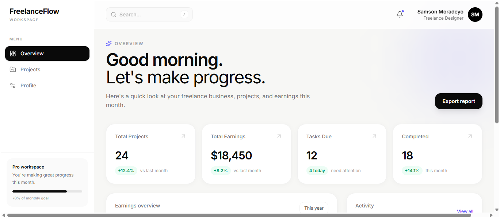
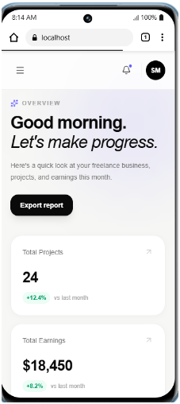

# FreelanceFlow

A modern, responsive freelance management dashboard built with React, TypeScript, Tailwind CSS, React Router, Recharts, and Motion.

FreelanceFlow provides a clean workspace for freelancers to monitor projects, earnings, activity, and account settings from a single dashboard.

## Preview

### Desktop View



### Mobile View



## Overview

FreelanceFlow is a fictional freelance client dashboard created as a frontend development project.

The application focuses on building a polished multi-page dashboard experience with reusable React components, client-side routing, responsive layouts, data visualization, and subtle interface animations.

The project was designed with both desktop and mobile users in mind.

## Features

### Dashboard Overview

- Summary cards for projects, earnings, tasks, and completion rate
- Monthly earnings visualization
- Recent activity feed
- Animated dashboard statistics
- Responsive dashboard layout

### Projects

- Project listing with client information
- Project status indicators
- Project deadlines
- Project budgets
- Responsive table layout on desktop
- Card-based layout on mobile
- Animated project entries

### Profile Settings

- Personal information form
- Email and professional role fields
- Password update interface
- Responsive form layout
- Focus and interaction states

### Navigation

- Persistent desktop sidebar
- Responsive mobile navigation drawer
- Client-side routing with React Router
- Animated mobile navigation
- Active navigation states

### Notifications

- Notification dropdown in the dashboard header
- Three most recent activities
- Animated open and close states
- Click-outside dismissal
- Responsive positioning

## Tech Stack

| Technology | Purpose |
| --- | --- |
| React | UI development |
| TypeScript | Static typing |
| Vite | Development and build tooling |
| Tailwind CSS | Styling and responsive design |
| React Router | Client-side routing |
| Recharts | Data visualization |
| Motion | UI animations |
| Lucide React | Interface icons |

## Project Structure

```text
src/
├── components/
│   ├── layout/
│   │   ├── DashboardLayout.tsx
│   │   ├── Header.tsx
│   │   ├── NotificationDropdown.tsx
│   │   ├── Sidebar.tsx
│   │   └── index.ts
│   │
│   ├── profile/
│   │   ├── ProfileForm.tsx
│   │   ├── SecurityForm.tsx
│   │   └── index.ts
│   │
│   ├── projects/
│   │   ├── ProjectStatusBadge.tsx
│   │   ├── ProjectTable.tsx
│   │   └── index.ts
│   │
│   └── ui/
│       ├── PageLoader.tsx
│       └── index.ts
│
├── data/
│   └── ...
│
├── pages/
│   ├── Overview.tsx
│   ├── Projects.tsx
│   ├── Profile.tsx
│   └── index.ts
│
├── types/
│   └── ...
│
├── App.tsx
└── main.tsx
```

## Architecture

The application follows a feature-oriented component structure.

Reusable components are grouped by responsibility rather than placing all components into a single directory.

Barrel exports are used within component modules to keep imports clean and make the structure easier to maintain.

Pages are loaded using React's lazy() and Suspense APIs to provide route-level code splitting.

```text
App
│
├── BrowserRouter
│
├── Suspense
│
└── DashboardLayout
    │
    ├── Sidebar
    ├── Header
    │   └── NotificationDropdown
    │
    └── Outlet
        ├── Overview
        ├── Projects
        └── Profile
```

## Responsive Design

FreelanceFlow uses a responsive-first approach.

### Desktop

Fixed sidebar navigation
Persistent dashboard header
Data-rich project table
Multi-column layouts

### Mobile

Animated navigation drawer
Compact header
Responsive project cards
Stacked dashboard sections
Mobile-friendly profile forms
Viewport-safe notification dropdown

The interface was tested across mobile, tablet, laptop, and desktop layouts.

## Performance

The application uses route-level code splitting to avoid loading every dashboard page on the initial request.

Instead of importing every page into the initial bundle:

```text
Initial load
    ↓
Dashboard shell
    ↓
Current route
```

Pages are loaded dynamically:

```text
const Overview = lazy(() => import("./pages/Overview"));
const Projects = lazy(() => import("./pages/Projects"));
const Profile = lazy(() => import("./pages/Profile"));
```

This reduced the initial JavaScript bundle from approximately 735 kB to 367 kB during the production build.

The production build also completes without the previous Vite chunk-size warning.

## Getting Started

### Prerequisites

Make sure you have Node.js installed.

Check your versions:

```text
node -v
npm -v
```

### Installation

Clone the repository:

```text
git clone https://github.com/psalmotee/freelance-dashboard
```

Navigate into the project:

```text
cd freelance-dashboard
```

Install dependencies:

```text
npm install
```

Start the development server:

```text
npm run dev
```

Open the local development URL provided by Vite.

## Available Scripts

### Development

```text
npm run dev
```

Starts the Vite development server.

### Production Build

```text
npm run build
```

Runs TypeScript compilation and creates the production build.

## Current Scope

This project uses mock data and is intentionally frontend-focused.

The following functionality is currently represented as UI rather than connected to a backend:

Authentication
Project creation
Project search
Project filtering
Profile persistence
Password changes
Notification persistence

### Future Improvements

Possible future additions include:

Backend integration
Authentication
Real project CRUD operations
Functional project search and filtering
Persistent notifications
Client management
Invoice tracking
Advanced analytics
Dark mode
Automated testing
End-to-end testing
License

## Author

### Samson Tolulope Moradeyo

Frontend Developer

- GitHub: [@Psalmotee](https://github.com/Psalmotee)
- LinkedIn: [Samson Moradeyo](https://www.linkedin.com/in/samson-moradeyo-211b26187/)

This project is available for educational and portfolio purposes.
